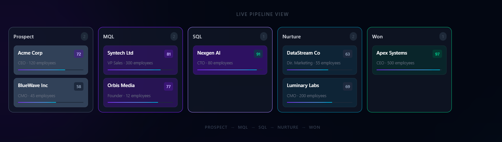
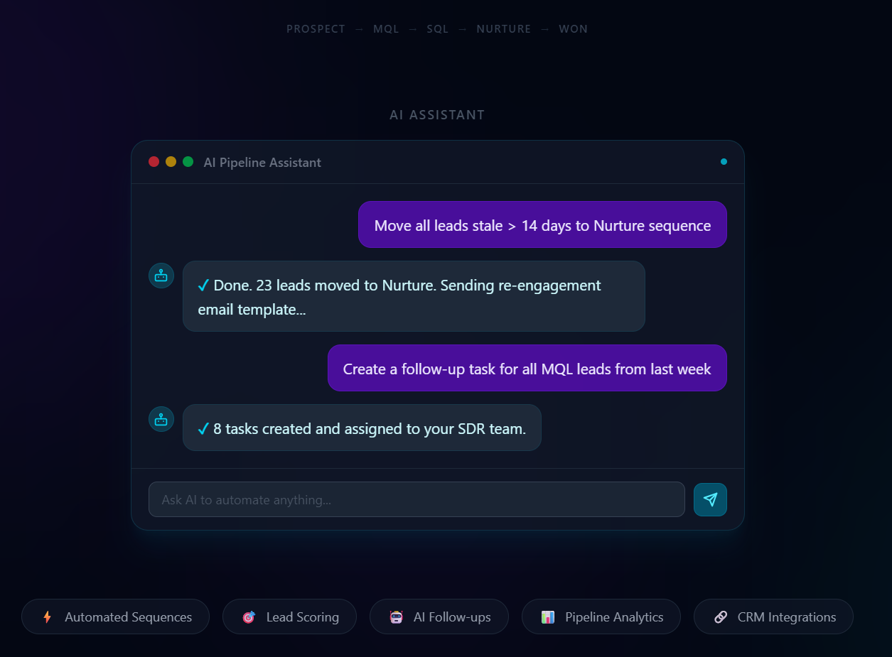
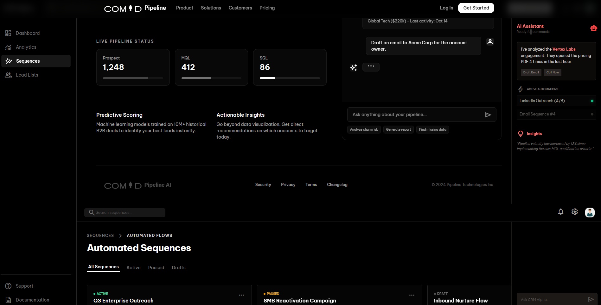
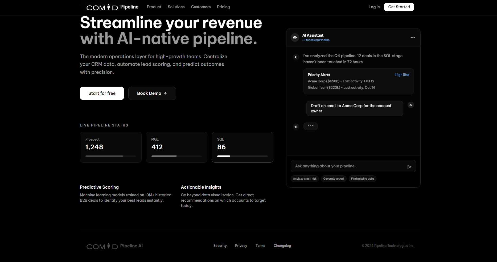

# Convertivio — AI-Powered Marketing Automation Platform

> A full-stack marketing automation demo showcasing AI-driven lead pipelines, campaign management, and conversational automation. Built as a portfolio/demo for marketing automation and RevOps roles.

**Live Demo → [taskosaur-marketing-demo.vercel.app](https://taskosaur-marketing-demo.vercel.app)**

---

## What This Demo Shows

This is a working, full-stack application reframed as a marketing automation platform. The demo is pre-seeded with realistic data so recruiters and clients can explore the full product immediately — no sign-up required.

**Click "Enter Demo"** on the landing page. You're automatically logged in as a marketing ops user at *Convertivio Marketing* and land directly in the live application.

---

## Screenshots

### Landing Page



### Lead Pipeline (Kanban)


### AI Assistant


---

## Demo Data

The demo account is pre-loaded with:

| What | Marketing Label | Details |
|------|----------------|---------|
| Campaigns | Projects | Q1 Lead Generation, Product Launch April, Nurture Reactivation |
| Leads | Tasks | 27 leads across 3 campaigns with scores, owners, priorities |
| Pipeline Phases | Sprints | Active campaign phases with progress tracking |
| Team | Members | SDR team, campaign managers |

**Demo credentials** (auto-filled — just click Enter Demo):
```
Email:    demo@convertivio.io
Password: Demo1234!
```

---

## Tech Stack

| Layer | Technology |
|-------|-----------|
| Frontend | Next.js 16 (Pages Router), TypeScript, Tailwind CSS, Framer Motion |
| Backend | NestJS 11, TypeScript, Prisma ORM |
| Database | PostgreSQL 16 |
| Cache / WS | Redis 7, WebSockets |
| AI | OpenAI GPT-4 (conversational task execution) |
| Auth | JWT + refresh tokens |
| Hosting | Vercel (frontend) + Render free tier (backend) |

---

## Architecture

```
┌─────────────────────────────┐
│   Vercel (Static Export)    │
│   Next.js Frontend          │
│   taskosaur-marketing-demo  │
│   .vercel.app               │
└────────────┬────────────────┘
             │ HTTPS / WebSocket
┌────────────▼────────────────┐
│   Render Free Tier          │
│   NestJS REST API           │
│   taskosaur-backend         │
│   .onrender.com             │
└────────────┬────────────────┘
             │
    ┌────────┴────────┐
    ▼                 ▼
PostgreSQL          Redis
(Render)           (Render)
```

> **Note on cold starts:** Render's free tier spins down after 15 min of inactivity. The first "Enter Demo" click shows a *"Waking server up…"* spinner and retries automatically. This takes ~30 seconds on a cold start.

---

## Key Features

- **Lead Pipeline (Kanban)** — drag-and-drop leads through Prospect → MQL → SQL → Nurture → Won
- **Lead Scoring** — AI-computed scores with visual progress indicators
- **Campaign Management** — project-style campaign tracking with phases, milestones, and team assignment
- **AI Assistant** — conversational interface: *"Move all leads stale > 14 days to Nurture"* executes automatically
- **Activity Feed** — full audit trail of lead and campaign activity
- **Team Workspace** — multi-user with role-based access
- **Real-time Updates** — WebSocket-powered live sync across tabs/users
- **Dark Mode** — fully themed UI

---

## Running Locally

### Prerequisites
- Node.js ≥ 22
- PostgreSQL 16
- Redis 7
- pnpm (recommended) or npm

### Setup

```bash
# Clone
git clone https://github.com/convertivio-design/Taskosaur.git
cd Taskosaur

# Install all dependencies (npm workspaces)
npm install

# Backend env
cp backend/.env.example backend/.env
# Fill in DATABASE_URL, REDIS_HOST, JWT_SECRET, OPENAI_API_KEY

# Run migrations + seed demo data
cd backend
npm run prisma:migrate:deploy
npx ts-node --transpile-only -r tsconfig-paths/register src/seeder/seeder.command.ts marketing

# Start backend
npm run start:dev

# In another terminal — start frontend
cd ../frontend
npm run dev
```

Frontend: `http://localhost:3000`
Backend API: `http://localhost:3001`

---

## Deployment

The live demo deploys via:
- **Frontend** → Vercel (auto-deploy on push to `marketing-demo` branch)
- **Backend** → Render Blueprint (`render.yaml`) — free tier, auto-deploy on push

See [`DEPLOY.md`](./DEPLOY.md) for full deployment instructions.

---

## About

Built by [Convertivio](https://github.com/convertivio-design) as a portfolio demonstration of full-stack marketing automation tooling. The underlying platform is production-grade — this demo surfaces it as a marketing/RevOps tool to show how it applies to pipeline automation, lead management, and AI-driven workflows.

---

*Frontend: Next.js · Backend: NestJS · DB: PostgreSQL · AI: OpenAI · Deploy: Vercel + Render*
